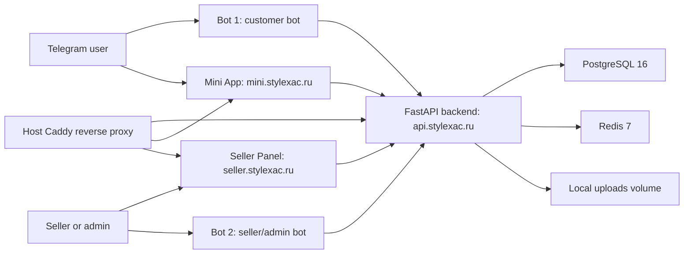

# Architecture

This document describes the current StyleXac production architecture. It documents implemented behavior only.

## Components



## Production Topology

| Item | Value |
| --- | --- |
| Server | Aeza Frankfurt |
| SSH alias | `tsplatform-frankfurt` |
| Project path | `/opt/telegram-shop` |
| Compose file | `docker-compose.prod.yml` |
| Backend env file | `backend/.env.production` |
| Main domain | `https://stylexac.ru` |
| Mini App | `https://mini.stylexac.ru` |
| API | `https://api.stylexac.ru` |
| Seller Panel | `https://seller.stylexac.ru` |
| Current migration head | `20260712_0054` |

Production uses Docker Compose for application services and host Caddy for TLS and reverse proxying. HTTP/3/QUIC is intentionally disabled in Caddy. The host `tsplatform-mss-clamp.service` intentionally clamps TCP MSS for ports `80` and `443` to improve Telegram WebView, VPN, and MTU compatibility.

## Backend Layering

Backend modules live under `backend/app/modules/<feature>/`.

```text
backend/app/modules/<feature>/
├── router.py       # FastAPI endpoints only
├── schemas.py      # Pydantic request/response DTOs
├── service.py      # business logic and transactions
└── repository.py   # SQLAlchemy queries
```

Rules:

- Routers parse requests, call services, and return responses.
- Services own business rules, authorization decisions, side-effect ordering, and transactions.
- Repositories own SQLAlchemy queries.
- SQLAlchemy models currently live in `backend/app/db/models.py`.
- Alembic migrations are required for schema changes.
- Async SQLAlchemy sessions are used for database access.

## Backend Modules

| Module | Responsibility |
| --- | --- |
| `analytics` | User behavior and banner telemetry events |
| `audit` | Critical seller/admin action audit logs |
| `auth` | Telegram Mini App auth, JWT issuance, session refresh support |
| `banners` | Banner CRUD, public banner delivery, view/click analytics |
| `cart` | Cart item persistence and totals |
| `categories` | Category CRUD and public taxonomy |
| `channel_entry` | Bot 1 channel message publication and pin history |
| `customer_notifications` | Bot 1 subscriptions, write access, service notifications, campaigns |
| `feed` | Mixed public feed combining active listed products and active listed Looks |
| `favorites` | Customer favorite products |
| `idempotency` | Idempotent checkout protection |
| `looks` | Independent Look/outfit entities, Look images, product components, Look cart add |
| `manual_payments` | Manual payment settings, receipt upload, payment expiration |
| `notifications` | Seller/admin notification helpers |
| `orders` | Transactional checkout, order status changes, order notifications |
| `products` | Product catalog, images, variants, inventory, search aliases |
| `promo_codes` | Coupons, validation, usage limits, usage snapshots |
| `returns` | Return requests, attachments, lifecycle, manual refund/restock processing |
| `reviews` | Purchase-gated moderated reviews |
| `route_aliases` | Slug alias storage and resolution for durable public category, product, and Look links |
| `seller_auth` | Seller/admin Telegram auth and registration flow |
| `seller_bot` | Bot 2 seller/admin bot flows |
| `statistics` | Seller/admin dashboard statistics |
| `tags` | Tag CRUD and public taxonomy |
| `telegram` | Bot webhook endpoints and Telegram transport routing |
| `uploads` | Local upload validation, storage, public URL building |
| `users` | User records and role management |

## Auth Flow

1. Mini App waits for `Telegram.WebApp.initData`.
2. Mini App sends raw `initData` to the backend login endpoint.
3. Backend validates Telegram signature, `auth_date`, and user payload server-side.
4. Backend upserts a `User` by Telegram user data.
5. Backend links an existing customer subscription by `telegram_user_id` when possible.
6. Backend issues a JWT session.
7. Mini App coordinates `401` refresh attempts so only one refresh is in flight, then replays the failed API request once.

Raw `initData` is never stored. Auth logs contain sanitized diagnostics only.

## Bot Responsibility Split

| Bot | Responsibilities |
| --- | --- |
| Bot 1 | Customer `/start`, customer `/stop`, customer service notifications, customer campaigns, channel entry publish/pin operations |
| Bot 2 | Seller/admin/auth-related flows |

Bot 2 must not be used for buyer notification or channel-entry buyer flows.

## Catalog Flow

Products support categories, tags, images, variants, inventory, active/public visibility, `old_price`, brand display, search aliases, and search priority. Multi-category assignments use priority values `1`, `2`, and `3`.

Search uses normalized input, aliases, color synonym expansion, product/category/tag fields, priority ordering, and PostgreSQL trigram similarity when the database extension is present.

Public product, category, and Look links use entity-level slug aliases through `route_aliases`. The backend stores old slugs by entity type (`PRODUCT`, `CATEGORY`, `LOOK`) and entity id, not full domains or full paths. Public resolvers try the current slug first, then an active alias, and return canonical current slugs so the Mini App can replace old URLs without adding a history entry. Product detail links resolve category and product aliases independently, preserving query parameters such as `sku`.

`Product.is_listed=false` hides products from feed, category, search, tags, suggestions, and related products, but direct public links still open when the product is `ACTIVE`. `Product.is_returnable` is copied to `OrderItem.is_returnable` at checkout. `Product.size_group` drives clothing, footwear, or one-size behavior in Looks.

## Mixed Feed and Looks

`GET /api/v1/feed` returns mixed feed items of type `product` and `look`. Feed queries include only `ACTIVE` plus listed products and only `ACTIVE` plus listed Looks. Products and Looks remain separate data models.

Looks are independent outfit entities with custom images and `LookItem` product references. Looks do not have stock of their own. Hidden active products may be included inside a public Look. Look add-to-cart validates selected Look components, independent clothing and footwear size selectors, variant availability, and stock before committing grouped cart items.

Look-sourced cart and order items carry source metadata and a shared `source_group_id`, allowing the Mini App and Seller Panel to group them with `Куплено из образа: <Look title>`.

## Checkout Flow

1. Customer cart is loaded and validated.
2. Promo code is validated when present.
3. Product variants are checked for active status and available stock.
4. Order and `OrderItem` snapshot rows are created in one transaction.
5. Variant stock is decremented inside the checkout transaction.
6. `CouponUsage` is recorded when a coupon is applied.
7. Cart rows are cleared.
8. Transaction commits.
9. Seller and customer notifications are emitted only after successful persistence.

`OrderItem` is an immutable purchased-product snapshot. It stores product and variant identifiers, product name, size, size grid, color, SKU, unit price, quantity, and subtotal.

For Look-sourced purchases, `OrderItem` also snapshots Look source metadata. For return eligibility, `OrderItem.is_returnable` stores the product returnability value at checkout time.

## Returns Flow

Returns are allowed only for `DELIVERED` orders within the 14-day return window. The window starts at `orders.delivered_at` when present, otherwise order creation time. One return request is allowed per order, and each request can include a subset of order items and quantities.

Return statuses are `PENDING`, `APPROVED`, `REJECTED`, `COMPLETED`, and `CANCELLED`. Customers can create eligible requests and cancel their own pending requests. Seller/admin users can approve, reject, cancel, complete, and process manual refund/restock details. Restock is explicit and delta-safe; no automatic payment-provider refund exists.

Return notifications go to `TELEGRAM_RETURNS_CHAT_ID` with media attachments and approve/reject buttons. The Telegram callback handler requires a seller/admin identity and rejects return callbacks outside the configured returns group.

## Customer Notification Flow

Bot 1 owns buyer notification delivery.

- `/start` in a private chat creates or updates `CustomerTelegramSubscription`, records real chat state, and enables service and marketing eligibility.
- `/stop` disables service and marketing eligibility.
- Mini App write access is requested only after a user action.
- `POST /api/v1/customer-notifications/me/write-access` persists grant or denial.
- Granting write access enables service notifications and does not silently enable marketing.
- Service notifications prefer `telegram_chat_id` for a real private chat. When no private chat exists, current backend logic may use `telegram_user_id` if `write_access_granted=true`.
- Campaign delivery requires a real private Bot 1 chat and eligible opt-in state.

Telegram delivery failures update subscription state where appropriate. For example, a `403` response marks the user as blocked and removes active private-chat eligibility.

## Channel Entry Flow

Seller Panel route `/channel-entry` asks the backend to publish a Bot 1 channel message. The inline button is a URL button to the Mini App start parameter:

```text
https://t.me/CheckYouStyleBot?startapp=channel_pin
```

If `TELEGRAM_MINI_APP_SHORT_NAME` is configured, the link builder can produce the short-name Mini App path. For Telegram channels, the platform uses URL buttons instead of `web_app` buttons.

Channel entries support zero to four uploaded photos. A single photo carries the caption and inline button. Multiple photos are sent as a Telegram media group, followed by a separate text/button entry message; the separate entry message is pinned, while all album message ids are stored in history. Supported button styles are `default`, `primary`, `success`, and `danger`, with automatic unstyled fallback when Telegram rejects the style field.

Channel-entry auth through `initData` creates or updates a `User`, but it does not create a real private Bot 1 chat. Users from this path need either a real Bot 1 private chat or Mini App write access for service notifications.

## Uploads

The backend stores files locally and persists paths/URLs in PostgreSQL. File bytes are not stored in PostgreSQL.

Upload categories:

- product images
- banner images
- category images
- tag images
- review images
- customer campaign images
- channel-entry photos
- manual payment receipts
- temporary files

Validation covers file size, extension, MIME, image decoding, safe filenames, path containment, and aspect ratio for configured image profiles.

## Image Profiles

| Profile | Implemented ratio |
| --- | --- |
| Product image | `4:5` |
| Category image | `4:3` |
| Tag image | `4:3` |
| Horizontal native banner | `400:207` |
| Vertical banner | `9:16` |
| Popup banner | `3:4` |
| Aggressive popup banner | `9:16` |

The current horizontal banner implementation is `400:207`. Older product notes may mention `3:1`, but backend validation and Seller Panel crop UI currently use `400:207`.

## Frontend Boundaries

The Mini App uses Telegram SDK/WebApp APIs only at the UI boundary. It uses the backend OpenAPI contract and environment-based API base URLs. It must not hardcode production API URLs.

The Seller Panel is a desktop-first operational dashboard. It uses the same backend API contract, but its visual language and workflow density are intentionally different from the Mini App.

## Background Workers

FastAPI lifespan starts background workers when their settings allow it:

- customer campaign delivery worker
- manual payment expiration worker

Workers run inside the backend process in the current deployment.

## Current Handover

The comprehensive current-state handover is `docs/PROJECT_HANDOVER.md`.

## Transactional Outbox

Order and manual-payment state changes enqueue an immutable `OutboxEvent` in the same
SQLAlchemy transaction as the business data. Each event owns independent `seller` and/or
`customer` `OutboxDelivery` rows, so one destination can retry without losing the other.

The lifespan outbox worker claims due or abandoned events with PostgreSQL
`FOR UPDATE SKIP LOCKED`, commits the claim, and only then calls existing notification
formatters/publishers. It records each consumer result separately and marks the parent event
`PROCESSED`, retryable `PENDING`, or terminal `FAILED`. Delivery is at-least-once. Durable
source-event keys prevent duplicate notification rows; Telegram itself has no exactly-once
or idempotency-key API, so a crash after Telegram accepts a message but before the local
acknowledgement can still cause a duplicate message.

Analytics remains best-effort post-commit telemetry and is intentionally outside this outbox.
Return-request seller notification is still a direct post-commit send and is a documented
remaining reliability gap rather than an outbox consumer.
