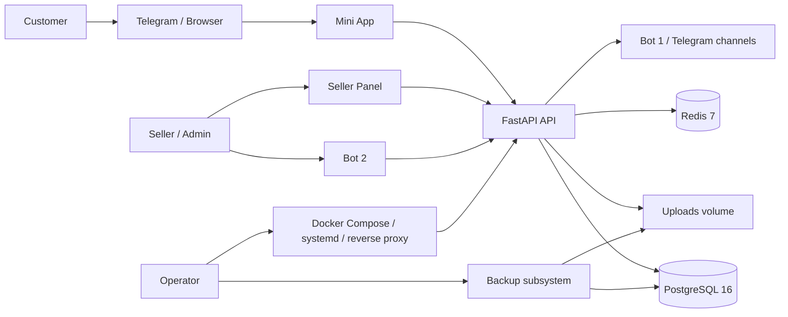
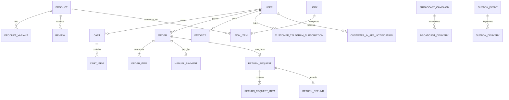

# Авторитетное описание TelegramShopPlatform / ICON STORE

Статус: главный project source of truth. Последняя проверка: 2026-07-13.
Конфиденциальность: Internal.

## 1. Идентичность

| Поле | Значение |
| --- | --- |
| Repository / platform | TelegramShopPlatform / StyleXac |
| Product name | ICON STORE |
| Production branch | `main` |
| Snapshot / commit | 2026-07-13 / `325e3af2a79dd9d4af92050e272169828d0edfbf` |
| Alembic head | `20260713_0056` |
| Production path | `/opt/telegram-shop` |
| Domains | `stylexac.ru`, `mini.stylexac.ru`, `api.stylexac.ru`, `seller.stylexac.ru` |
| Deprecated domain family | `tsplatform.ru` |

Repository URL/ownership metadata не зафиксированы в tracked files как утвержденный business
record. **NEEDS VERIFICATION**: owner должен подтвердить legal owner и canonical Git remote;
это блокирует due diligence, но не development/deployment из существующего clone.

## 2. Бизнес-назначение

Платформа позволяет магазину продавать товары через Telegram Mini App, обрабатывать catalog,
orders, manual payments, returns и customer communications в Seller Panel/Bots. Целевой seller —
магазин с управляемым каталогом и готовностью вручную подтверждать оплату/возврат. Целевой customer —
пользователь Telegram или browser storefront.

Поддерживаемая модель — отдельное внедрение магазина. Multi-tenancy и tenant isolation в моделях
не реализованы; общий SaaS для независимых sellers нельзя заявлять без redesign. Catalog import,
ERP inventory sync, acquiring и fiscal receipts не входят в standard deployed scope.

## 3. Пользователи и роли

| Actor | Возможности | Ограничения |
| --- | --- | --- |
| Unauthenticated | public feed, taxonomy, Looks, reviews, suggestions, health | cart/order/favorites требуют JWT |
| `USER` | owned profile/cart/orders/payments/returns/reviews/favorites/notifications | нет seller/admin mutation |
| `SELLER` | operational catalog, orders, payments, returns, campaigns, channel entry | отдельные admin-only endpoints запрещены |
| `ADMIN` | seller scope плюс user blocks, audit/outbox administration | доступ требует JWT и active user |
| Bot 1 user | customer subscription/channel entry | campaign требует real private chat |
| Bot 2 user | seller/admin callbacks | identity/role/group checks обязательны |
| Operator | host, deployment, backup, restore, incidents | не является application role |
| Support | customer/seller communications по runbook | owner и hours не утверждены |

Источник: `backend/app/common/deps.py`, routers/services в `backend/app/modules/`,
`backend/app/db/models.py`, `UserRole`.

## 4. Полный feature inventory

| Feature | User / entry | Backend / frontend | Rules | Status / evidence | Limitation |
| --- | --- | --- | --- | --- | --- |
| Telegram auth | Customer / Mini App | `auth`; `AuthProvider` | signed/fresh `initData`, JWT | deployed; auth tests | Telegram dependency |
| Seller auth | Seller Panel / Bot 2 | `seller_auth`, `/login` | email/password + Telegram approval flow | implemented | operational approval required |
| Catalog | Public + seller | `products`; product pages/editor | ACTIVE/listing/stock/variants | deployed; product tests | no bulk import |
| Taxonomy | Public + seller | `categories`, `tags`, `/taxonomy` | up to 3 assignments, priority | deployed | manual curation |
| Search | Public | `products/search.py`, search pages | aliases, `pg_trgm`, priority | deployed | not a dedicated search engine |
| Feed | Public | `feed`, MainPage | listed ACTIVE Products/Looks | deployed | priority is manual |
| Looks | Public + seller | `looks`, Look pages | components, size groups, grouped cart | deployed | default metadata not applied to initial UI selection |
| Cart | Customer | `cart`, CartPage | ownership, selected items, live prices/stock | deployed | no reservation until checkout |
| Checkout | Customer | `orders`, CheckoutPage | atomic stock, idempotency, measurements | deployed | address required even for Pickup by schema/service |
| Delivery | Customer | `orders/delivery.py` | fixed price snapshot | deployed | no carrier API/tracking integration |
| Promo | Customer + seller | `promo_codes` | goods subtotal only, usage limits | deployed | manual setup |
| Orders | Customer + seller | `orders`, order pages | immutable snapshots, audit/outbox | deployed | non-linear seller correction allowed |
| Manual payment | Customer + seller/Bot 2 | `manual_payments` | 30-minute reservation, receipt/approval | deployed | no provider/automatic receipt |
| Returns/refunds | Customer + seller/Bot 2 | `returns` | delivered + 24h, attachments, partial | deployed | legal review required; refund manual |
| Reviews | Customer + seller | `reviews` | purchased product, moderation | deployed | no automatic moderation |
| Favorites | Customer | `favorites` | owned unique user/product | deployed | authenticated only |
| Banners | Public + seller | `banners` | destination/display types, analytics | deployed | content governance manual |
| Customer Bot 1 | Customer | `customer_notifications`, `telegram` | `/start`, `/stop`, opt-ins/write access | deployed | private-message rules |
| Campaigns | Seller | campaign module/Seller Panel | eligible private chats, retries | deployed | simplified UI vs backend templates |
| In-app status | Customer | `customer_in_app_notifications`, App controller | durable, oldest first, seen | deployed | no historical bulk backfill |
| Channel entry | Seller/Channel | `channel_entry`, `/channel-entry` | Bot 1 URL `startapp`, optional pin | deployed | does not create private chat state |
| Uploads | Seller/customer | `uploads`, payment/return flows | MIME/size/path controls | deployed | local volume growth/cleanup gap |
| Analytics/audit | Seller/admin | `analytics`, `audit` | privacy-safe events/action logs | implemented | audit completeness not certified |
| Outbox | Operator/admin | `outbox`, background worker | retry, fencing, diagnostics | deployed | at-least-once, Telegram not exactly-once |
| Backup | Operator | `backup_production.py`, systemd | dump/uploads/metadata/checksum/restore verify | local verified | remote conditional; unit path drift |

Подробная доказательная матрица: [sales/FEATURE_EVIDENCE_MATRIX.md](sales/FEATURE_EVIDENCE_MATRIX.md).

## 5. Архитектура

FastAPI app включает 193 OpenAPI operations на 155 paths. Background tasks: campaigns,
manual-payment expiration и outbox worker. Reverse proxy обслуживается host layer; Caddy example
проксирует `/api/*` и `/uploads/*` с frontend domains.

Источник: `backend/app/main.py`, `backend/app/api/router.py`, `docker-compose.prod.yml`,
`deploy/caddy/Caddyfile.frankfurt.example`.

## 6. Domain model

Полная таблица: [engineering/DATABASE_SCHEMA.md](engineering/DATABASE_SCHEMA.md).

## 7. Канонические business rules

1. PostgreSQL — source of truth; Redis не хранит незаменимое order state.
2. Raw Telegram `initData` не сохраняется/не логируется; signature и age проверяются backend.
3. Checkout работает только с selected cart items, блокирует variants `FOR UPDATE`, проверяет
   ACTIVE/is_active/available stock, создает Order/Payment/Items/CouponUsage/outbox и уменьшает
   stock в одной transaction.
4. Promo discount применяется к goods subtotal; delivery прибавляется после discount.
5. `OrderItem` хранит name, size/grid/color, SKU, price, quantity, subtotal, returnability и Look source.
6. Pickup имеет price 0, но текущий `OrderCheckoutCreate.delivery_address` обязателен для всех methods.
7. Height: integer `1..300`; weight: decimal `>0..1000`. Legacy comment parsing применяется
   только если explicit field отсутствует.
8. Manual payment начинается `PENDING`, expires через 30 минут; approve переводит order в
   `PROCESSING`, reject/expire — в `CANCELLED` с release stock.
9. Return: только `DELIVERED` с `delivered_at`, не позднее 24 часов; максимум один request/order;
   partial items разрешены; 1–5 image/video attachments обязательны, до 20 MiB каждый.
10. Refund — manual record; delivery не включается автоматически; restock выполняется только
    explicit plan и delta-safe.
11. Product `is_listed=false`: скрыт из feed/category/search/suggestions/similar; ACTIVE direct
    detail остается доступным; hidden ACTIVE product разрешен внутри Look.
12. Campaign требует real private Bot 1 chat; write access без chat подходит только для service send.
13. Notifications создаются вместе с persisted transition; delivery начинается после commit/outbox.

Canonical rules: [product/BUSINESS_RULES.md](product/BUSINESS_RULES.md).

## 8. State machines

| Entity | States / transitions |
| --- | --- |
| Product | `DRAFT`, `ACTIVE`, `OUT_OF_STOCK`, `ARCHIVED`; seller mutation; archive terminal by convention |
| Look | `DRAFT`, `ACTIVE`, `ARCHIVED`; ACTIVE requires active components and ≥1 stored default |
| Order | `NEW`, `PROCESSING`, `SHIPPED`, `DELIVERED`, `CANCELLED`; seller/admin endpoint permits non-linear correction/re-entry, subject to payment guard |
| Payment | `PENDING` → `SUBMITTED` → `APPROVED`/`REJECTED`; PENDING/SUBMITTED → `EXPIRED`; `CANCELLED` enum exists but no customer cancellation endpoint verified |
| Return | `PENDING` → `APPROVED`/`REJECTED`/`CANCELLED`; `APPROVED` → `COMPLETED`/`CANCELLED` |
| Refund | `PENDING` → `RECORDED` |
| Review | `PENDING` → `APPROVED`/`REJECTED` |
| Campaign | `draft`, `scheduled`, `sending`, `paused`, `completed`, `cancelled`, `failed` |
| Outbox | `PENDING` → `PROCESSING` → `PROCESSED`/`FAILED`; admin retry resets FAILED |

Canonical lifecycle documents: [product/ORDER_LIFECYCLE.md](product/ORDER_LIFECYCLE.md),
[product/PAYMENT_LIFECYCLE.md](product/PAYMENT_LIFECYCLE.md),
[product/RETURNS_AND_REFUNDS.md](product/RETURNS_AND_REFUNDS.md).

## 9. Notifications

Telegram customer, Telegram seller, campaigns, backup reports и in-app rows — разные channels.
In-app начальные `NEW`, `PENDING payment` и `PENDING return` не показываются. Order
PROCESSING/SHIPPED/DELIVERED — Continue only; CANCELLED — contacts. Payment SUBMITTED — Continue;
APPROVED — photo + contacts; other terminal payment states — contacts. Все return terminal/decision
states — contacts. Pending rows выдаются oldest-first и подтверждаются server-side `seen_at`.

Canonical matrix: [product/NOTIFICATIONS.md](product/NOTIFICATIONS.md).

## 10. Operational model

Deployment: clean worktree → commit verification → compose config → verified backup → build →
Alembic heads/current/upgrade → recreate app services → health/log/manual smoke. PostgreSQL/Redis
не пересоздаются без необходимости. Rollback предпочитает previous image/code при сохранении
additive schema; schema downgrade — отдельное destructive решение.

Backup включает PostgreSQL dump, uploads archive, metadata и checksums, затем restore verification;
local retention 3 days/max 20, remote 14 days/max 2, upload cadence 7 successful local backups.
Remote status может быть `skipped` или `failed`. RPO/RTO `NOT APPROVED`.

Источник: `backend/scripts/backup_production.py`, `docker-compose.prod.yml`.

## 11. Security и privacy

Контроли: Telegram HMAC/freshness, HS256 JWT, RBAC, ownership queries, production config validation,
rate limits с Redis/in-memory fallback, CORS allowlist, ORM parameterization, upload validation,
sanitized request/error logging, audit/outbox/idempotency. Это evidence-based controls, не claim
о compliance. PII включает Telegram IDs, names, phone, address, height, weight, username, order/payment
evidence, return media, analytics/logs/backups. Retention/deletion/export policies требуют решения.

Canonical: [security/SECURITY_OVERVIEW.md](security/SECURITY_OVERVIEW.md) и
[legal/PERSONAL_DATA_PROCESSING_MAP.md](legal/PERSONAL_DATA_PROCESSING_MAP.md).

## 12. Testing and quality

Release snapshot: backend strict 1,098 passed/3 Linux-only locking skips on Windows; focused
PostgreSQL notification/outbox 19; migrations 48; focused backend 416; Mini App 258 plus focused 21;
Seller Panel 75; frontend builds, Mini App production Docker build и Alembic check passed.
Counts are not permanent acceptance thresholds.

Canonical: [TESTING.md](TESTING.md).

## 13. Sales readiness

Demo-ready с controlled scope. Pricing, SLA, RPO/RTO, legal docs и support model не утверждены.
Manual payments, single-server topology, conditional offsite backup и Telegram dependency должны
раскрываться до договора. [SALES_READINESS.md](SALES_READINESS.md).

## 14. Known limitations

Высшие риски: legal return rule, privacy lifecycle, payment/fiscal model, tenancy, single server,
offsite backup, DR targets, monitoring, support ownership и secret/access governance.
[KNOWN_LIMITATIONS.md](KNOWN_LIMITATIONS.md).

## 15. Open decisions

| Decision | Required stakeholder | Blocks |
| --- | --- | --- |
| Pricing and commercial terms | Owner/Sales | sales |
| SLA, RPO, RTO | Owner/Operations | contract/launch |
| Return/refund/legal wording | Russian lawyer | legal launch |
| Privacy retention/deletion/export | Legal/Product/Security | legal launch |
| Payment provider/fiscal receipts | Finance/Legal/Product | target sellers |
| Tenant strategy | Architecture/Business | multi-seller SaaS |
| Monitoring/on-call/support | Operations/Business | supported launch |
| Node.js supported LTS | Engineering | reproducible onboarding |

## 16. Source-of-truth map

| Fact | Canonical source |
| --- | --- |
| Production snapshot | `docs/PRODUCTION_STATE.md` |
| Statuses/lifecycles | `docs/product/*LIFECYCLE.md`, `RETURNS_AND_REFUNDS.md` |
| Delivery prices | `docs/product/DELIVERY.md` |
| Notification matrix | `docs/product/NOTIFICATIONS.md` |
| API | `backend/app/api/router.py`, routers/schemas, `docs/engineering/API_REFERENCE.md` |
| Database | models + migrations, `docs/engineering/DATABASE_SCHEMA.md` |
| Configuration | config/examples/Compose, `docs/engineering/CONFIGURATION.md` |
| Deployment | `docs/PRODUCTION_DEPLOYMENT.md` |
| Sales claims | `docs/sales/FEATURE_EVIDENCE_MATRIX.md` |
| Legal gaps | `docs/legal/*` |

