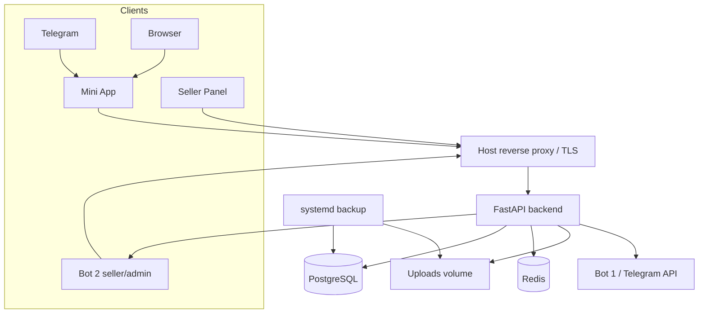

# Архитектура

TelegramShopPlatform — modular monolith: один FastAPI process/API и два React applications,
PostgreSQL source of truth, Redis auxiliary state, Telegram integrations и background workers.

Production Compose: backend, mini-app, seller-panel, PostgreSQL 16, Redis 7. Host proxy is not
defined as a Compose service in current file. API workers run in backend lifespan, so horizontal
scaling requires explicit worker/concurrency review.

Sources: `backend/app/main.py`, `backend/app/api/router.py`, `docker-compose.prod.yml`.

