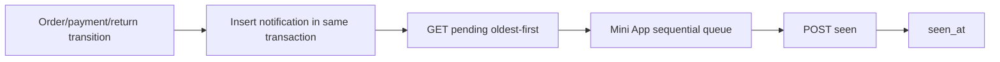

# In-app notifications architecture

`source_key` is unique and insertion uses named PostgreSQL `ON CONFLICT DO NOTHING`; other integrity
failures propagate. Pending query is user-owned and sorted by `occurred_at,id`. Acknowledgement locks
the row and is idempotent. APPROVED payment also synchronizes legacy banner `seen_at`.

Mini App polling plus route/focus/visibility refreshes do not replace server durable state. Popup
requires explicit action; seller contacts are loaded for action mode where applicable. Matrix:
[../product/NOTIFICATIONS.md](../product/NOTIFICATIONS.md).

Sources: `customer_in_app_notifications/*`, migration `0056`, Mini App controller/tests.

