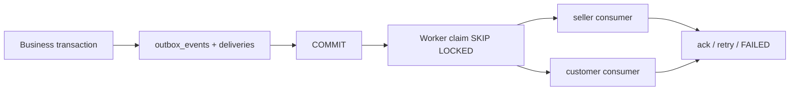

# Transactional outbox

Events store immutable JSON payload and one delivery per consumer. Worker atomically claims eligible
rows, commits claim before external calls, renews lease, fences stale acknowledgements with claim
token, retries exponential backoff up to max attempts and marks FAILED. Admin can inspect diagnostics
and retry failed event. `PROCESSING` abandoned claims recover after lock timeout.

Semantics: at-least-once. Unique DB delivery/source keys reduce duplicates, but Telegram send followed
by process crash before acknowledgement can duplicate external delivery. There is no separate
dead-letter table; `FAILED` event/delivery is the terminal diagnostic state until manual retry.

Sources: `outbox/repository.py`, `outbox/service.py`, `outbox/worker.py`, migrations `0053`,`0054`.

