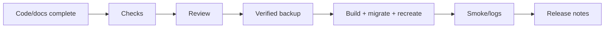

# Release process

Release evidence package contains commit, migrations, checks, backup result, deployment health/log
checks, manual smoke and known exceptions. Development release flow ends at reviewed artifact; only
authorized operator executes production procedure.

Schema roll-forward is default; downgrade requires data-loss analysis. Canonical operational steps:
[../PRODUCTION_DEPLOYMENT.md](../PRODUCTION_DEPLOYMENT.md). Release notes:
[../CHANGELOG.md](../CHANGELOG.md).

