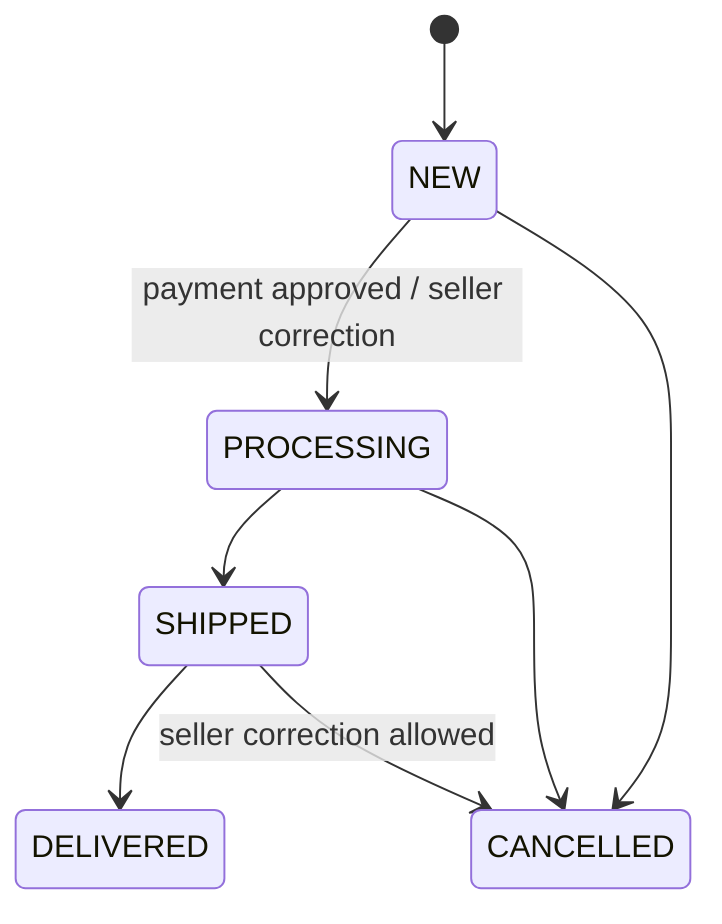

# Order lifecycle

## Creation

Order number is `ORD-` plus a six-digit sequence (`ORD-000001`…`ORD-999999`). Sequence exhaustion
raises an error; deleted/failed sequence values are not promised to be gapless. Checkout locks cart
and variants, creates immutable snapshots, decrements stock, records CouponUsage/manual payment and
commits outbox/domain state atomically.

Total formula: `goods subtotal - promo discount + delivery snapshot`.

Source: `orders/numbering.py`, `orders/repository.py`, `orders/service.py`.

## States

The diagram is the normal flow, not an API constraint. Seller/admin status endpoint assigns any
`OrderStatus`; non-linear moves and re-entry are possible and audited. When entering DELIVERED first
time, `delivered_at` is set; leaving and re-entering does not reset it. While payment is PENDING or
SUBMITTED, conflicting direct status changes are guarded and payment actions should be used.

Customer sees localized statuses in Mini App; raw enum remains API/storage representation.
Cancellation via payment reject/expire releases stock. No general customer order-cancel endpoint
was found.

## Links

One order has at most one manual payment and one return request. Return eligibility depends on
DELIVERED/`delivered_at`. Source: models `Order`, `OrderItem`, `ManualPayment`, `ReturnRequest`.

