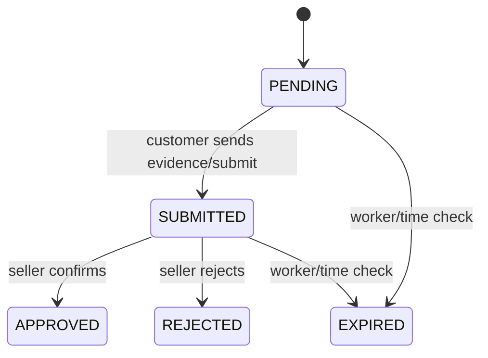

# Manual payment lifecycle

Current method: `SBP_PHONE`, currency `RUB`. Seller config supplies phone/bank/recipient; checkout
fails if usable settings are absent. A payment is created with 30-minute expiration.

`CANCELLED` exists in enum/notification copy, but no current customer cancellation endpoint was
verified. Do not market it as an exposed customer flow.

Approval sets order `PROCESSING`. Rejection/expiration sets order `CANCELLED` and releases stock.
Receipt is an uploaded path, not database binary. Approval/rejection is available in Seller Panel
and protected seller endpoints/Bot 2 callbacks. Customer and seller notifications follow persistence.

There is no YooKassa/Robokassa/acquiring/automatic confirmation/fiscal receipt integration.
Legacy `payment-success-banner` endpoints remain compatible; durable APPROVED notification is the
current popup source and may materialize one unseen legacy approved payment on demand.

Source: `manual_payments/service.py`, `manual_payments/router.py`, `orders/service.py`,
`customer_in_app_notifications/service.py`.

