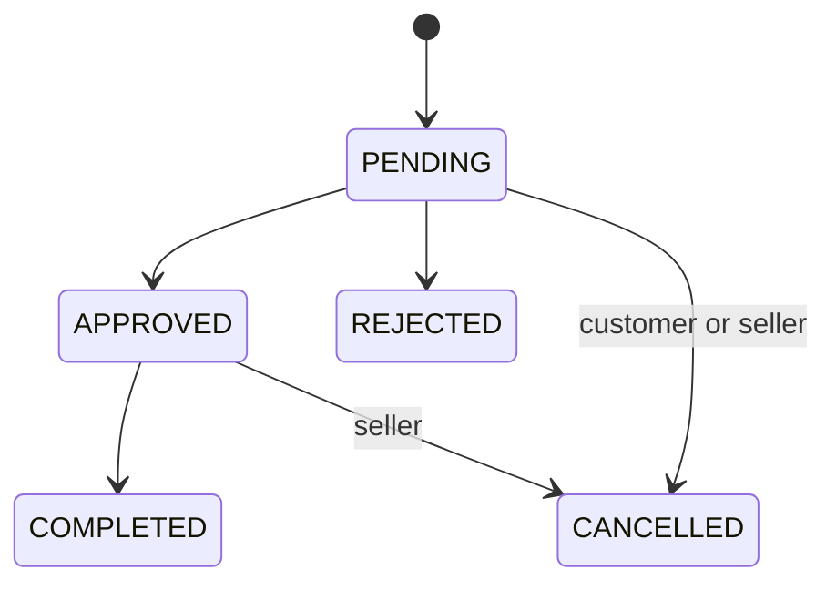

# Returns and refunds

> Документ описывает software behavior, а не дает юридическую консультацию. Правило должен
> проверить qualified Russian lawyer.

## Eligibility and request

- Order must be `DELIVERED` and have `delivered_at`.
- Deadline is `delivered_at + 24 hours`; code rejects only when `now > deadline`.
- One request per order (`uq_return_requests_order_id`). Partial item quantities supported.
- Only snapshots with `is_returnable=true`; at least one item selected.
- 1–5 attachments required; JPEG/PNG/WebP/MP4/WebM/QuickTime, each ≤20 MiB.
- Customer supplies reason and optional comment; UI requires confirmation of return rules.

Source: `returns/service.py`, `returns/schemas.py`, migration `20260701_0041`.

## Lifecycle

Customer can cancel only PENDING. Seller/admin can approve/reject PENDING; process/complete only
APPROVED; seller/admin cancellation supports PENDING/APPROVED. Seller Panel and Bot 2 operational
callback are supported; customer status is exposed through order/return flows and in-app notification.

## Refund and stock

Refund is a manual `ReturnRefund` record: `PENDING` then `RECORDED`. Default amount equals returned
goods snapshots; it cannot exceed their total and excludes delivery automatically. Method/comment are
operator-entered. No money is transferred by code. Stock restoration is explicit per-item target,
locks variants and applies only positive delta, preventing double restock.

Canonical legal gap: [../legal/RETURNS_POLICY_GAP_ANALYSIS.md](../legal/RETURNS_POLICY_GAP_ANALYSIS.md).

