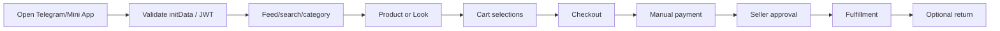

# User flows

## Customer order

Checkout failure leaves cart/domain state uncommitted. Payment approval changes order to PROCESSING.
Return appears only after DELIVERED with `delivered_at` and within 24 hours.

## Seller operations

Seller authenticates in Seller Panel, manages catalog/content, reviews new orders/payment evidence,
updates fulfillment, handles returns/refunds/restock, publishes channel entry and runs eligible
campaigns. Bot 2 callbacks are operational alternatives for approved flows, not Customer Bot 1.

## Notification enrollment

Bot 1 `/start` creates real private-chat state. Profile can request Telegram write access after user
action; this enables service sends only. Marketing requires separate opt-in and real private chat.

Sources: `mini-app/src/shared/router/RouterProvider.tsx`, `seller-panel/src/App.tsx`,
`orders/service.py`, `customer_notifications/service.py`.

